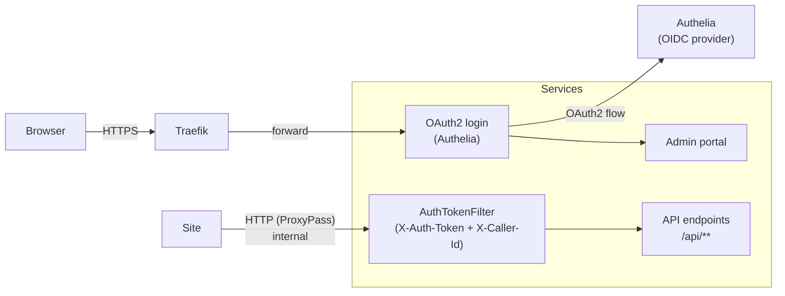
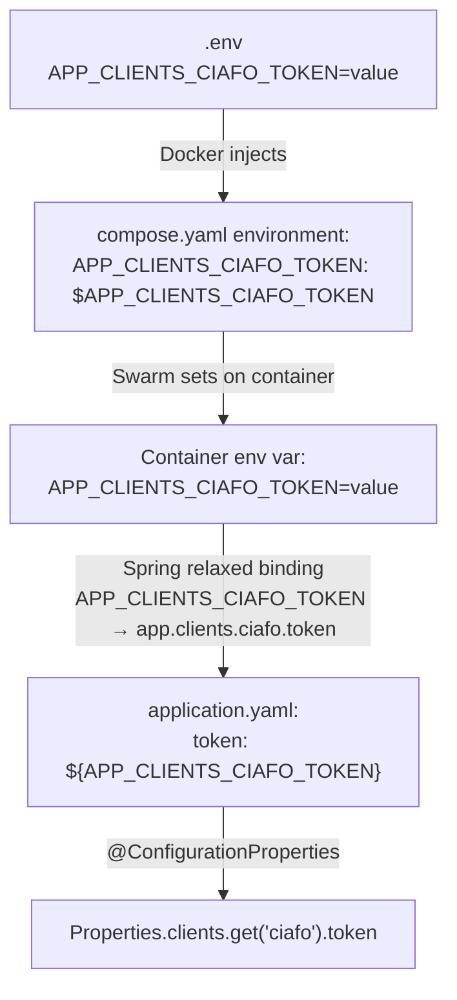

# Authentication & Authorization

## Architecture

Two auth mechanisms coexist:

1. **OAuth2/OIDC** — Authelia as identity provider, Spring Security as client. Protects the admin portal (browser sessions).
2. **Token-based API auth** — Static tokens in headers. Protects `/api/**` endpoints called by the static sites.



## Authelia (OIDC Provider)

- Image: `authelia/authelia`
- Exposed at: `oauth.outsideworx.net`
- Config: `authelia.yaml` (prod), `authelia-test.yaml` (test)
- Users: `authelia-users.yaml` (prod), `authelia-test-users.yaml` (test)
- Access policy: `one_factor` (password only, no 2FA)
- Password reset: disabled
- Consent mode: `implicit` (no consent screen)
- Storage: local SQLite (`/tmp/authelia-storage.db`)
- Metrics: port 81

### OIDC Clients

| Client ID | Redirect URI | Consumer |
|-----------|-------------|----------|
| `grafana` | `https://grafana.outsideworx.net/login/generic_oauth` | Grafana |
| `services` | `https://services.outsideworx.net/login/oauth2/code/authelia` | Spring Boot app |

### Users

- `admin` — `info@outsideworx.net`, group `admins` (GrafanaAdmin role)
- Per-client users — email-based (e.g., `info@come-in-and-find-out.ch`), no groups

### Portal Routing Logic

The `IndexController` extracts the domain from the authenticated user's email (regex: `(?<=@)[^.]+(?=\\.)`), maps it to a view name (`clients/<domain>`), and dispatches to the matching `ModelVisitor` implementation. If no view matches, throws `AccessDeniedException`.

Example: `info@come-in-and-find-out.ch` → domain `come-in-and-find-out` → view `clients/come-in-and-find-out`

### Prod vs Test

| Aspect | Prod | Test |
|--------|------|------|
| Domain | `outsideworx.net` | `localhost` |
| Secrets | Environment variables | Hardcoded in YAML |
| Private key | Docker secret (`rsa_private_key`) | Inline in config |
| Redirect URIs | `https://services.outsideworx.net/...` | `http://localhost:8080/...` |

## Spring Security (OAuth2 Client)

### WebSecurity Configuration

```java
httpSecurity
    .authorizeHttpRequests(request -> request
        .requestMatchers(
            "/actuator/**", "/api/**", "/grafana",
            "/img/**", "/ntfy", "/robots.txt", "/sitemap.xml")
        .permitAll()
        .anyRequest().authenticated())
    .oauth2Login(Customizer.withDefaults())
    .logout(logout -> logout.logoutSuccessUrl(logoutUrl))
    .csrf(AbstractHttpConfigurer::disable)
```

- Public paths: `/actuator/**`, `/api/**`, `/grafana`, `/img/**`, `/ntfy`, `/robots.txt`, `/sitemap.xml`
- Everything else requires OAuth2 authentication
- CSRF disabled (API is stateless, admin uses redirects)
- Logout redirects to Authelia's logout endpoint with `rd` param back to services

### OAuth2 Client Config (application.yaml)

- Provider: `authelia`
- Grant type: `authorization_code`
- Scopes: `email, groups, openid, profile`
- User name attribute: `preferred_username`
- Internal URLs (service-to-service): `http://services-authelia/...` (network alias, no TLS within overlay network)
- External URLs (browser redirects): `https://oauth.outsideworx.net/...`

## Token-Based API Auth

### How It Works

Static sites proxy `/api/` requests to the services container. Apache injects two headers:
- `X-Auth-Token` — per-client secret token (from environment variable `TOKEN`)
- `X-Caller-Id` — site identifier (from environment variable `NAME`)

### Configuration

In `application.yaml`:
```yaml
app:
  clients:
    ciafo:
      caller: "come-in-and-find-out"
      origin: "https://come-in-and-find-out.ch"
    peeps:
      caller: "gaiapeeps"
      origin: "https://gaiapeeps.com"
    soup:
      caller: "soupart"
      origin: "https://soupart.net"
```

Tokens are not present in `application.yaml`. Spring's relaxed binding maps the environment variable `APP_CLIENTS_CIAFO_TOKEN` to `app.clients.ciafo.token` automatically — underscores become dots, uppercase becomes lowercase. No explicit YAML entry is needed.

Mapped to `Properties.clients` (Map<String, Client>) where each `Client` has: `caller`, `origin`, `token`.

#### Token Resolution Flow



Spring's relaxed binding automatically maps the environment variable `APP_CLIENTS_CIAFO_TOKEN` to the property path `app.clients.ciafo.token` — underscores become dots, uppercase becomes lowercase. The `${...}` placeholder in YAML is redundant but explicit.

### AuthTokenFilter

- Extends `HttpFilter`, `@Component`, package-private
- Runs on every request; checks only if `notPreflightRequest && apiRequest`
- Validates: at least one configured client must match both `X-Caller-Id` and `X-Auth-Token`
- On failure: logs error, registers `bad_credentials` metric, throws `BadCredentialsException`
- On success: chains through (no principal set — API is stateless)

### FilterConditions

Reusable predicates in `configuration/utils/FilterConditions.java`:
- `apiRequest(request)` — URI starts with `/api`
- `cachedApiRequest(request)` — URI starts with `/api/cache`
- `notPreflightRequest(request)` — method is not `OPTIONS`
- `invalidCallerIdOrAuthToken(request)` — no configured client matches both headers

### CORS

- API controllers use `@CrossOrigin("${app.clients.<name>.origin}")` — restricts to the specific site's domain
- In test mode, origin is `"*"` (permissive)

## File Layout

```
services/
├── authelia.yaml                # Prod Authelia config
├── authelia-test.yaml           # Test Authelia config
├── authelia-users.yaml          # Prod user database
├── authelia-test-users.yaml     # Test user database
└── src/main/java/.../configuration/
    ├── WebSecurity.java         # SecurityFilterChain bean
    ├── AuthTokenFilter.java     # Token validation filter
    └── utils/
        ├── Properties.java      # Client config mapping
        └── FilterConditions.java # Request predicates
```

## Adding a New Client

See the `new-client` skill for the full step-by-step procedure (Authelia users, application config, env vars, Spring Boot code, site wiring).
