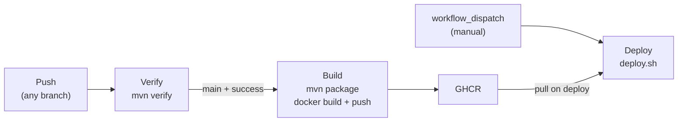
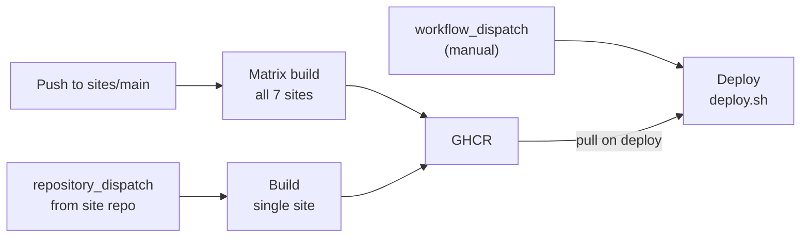
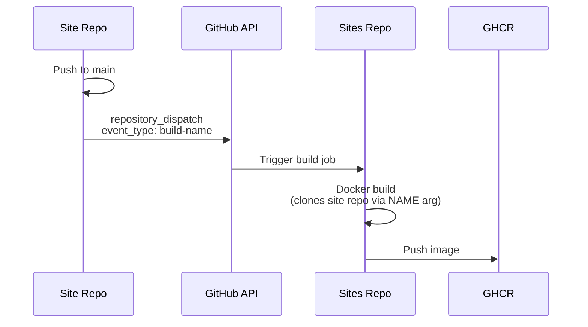

# GitHub Actions CI/CD

## Organization

- Org: [outsideworx](https://github.com/outsideworx)
- Registry: GitHub Container Registry (GHCR) at `ghcr.io/outsideworx/<name>`

## Self-Hosted Runner

All workflows run on a self-hosted runner (`runs-on: self-hosted`) — the same machine that hosts the production Swarm cluster. No GitHub-hosted runners are used.

### Prerequisites

The runner must have the following installed and available on `PATH`:

| Dependency | Used by | Purpose |
|------------|---------|---------|
| Java (JDK) | services verify, services build | Compiles source, runs unit + integration tests, packages the JAR |
| Maven | services verify, services build | Orchestrates the full build lifecycle (compile → test → package) |
| Docker Engine | all builds, all deploys | Builds container images, pushes to GHCR, deploys Swarm stacks |
| Docker Buildx | sites build, services build | Multi-stage image builds via `docker/build-push-action` |
| Git | all workflows | Repository checkout and submodule initialization |

### Implications

- No `setup-java` or `setup-node` actions — tooling is pre-installed on the host
- Deploy workflows run `deploy.sh` directly on the host — the runner is the production server
- Docker commands execute against the local daemon (same Swarm manager node)
- The runner must be authenticated to GHCR for image pulls during deploy (handled by `docker login` in build steps; deploy relies on credentials cached on the host)

## Secrets

| Secret | Purpose |
|--------|---------|
| `DISPATCH_TOKEN` | GitHub PAT with `repo` scope — used as GHCR password for image pushes and for sending `repository_dispatch` events to the `sites` repo |
| `ENV` | Full `.env` file content (written to `.env` before running `deploy.sh`) |

All secrets are org-level and inherited by all repos automatically.

## Services Pipeline

- **Verify** (`verify.yaml`): Runs `mvn verify` on every push. All branches.
- **Build** (`build.yaml`): Triggered by `workflow_run` on `main`; only runs if Verify concluded with `success` (`if: conclusion == 'success'`). Packages JAR, builds Docker image, pushes to GHCR.
- **Deploy** (`deploy.yaml`): Manual `workflow_dispatch`. Checks out repo, writes `.env` from secret, runs `deploy.sh` directly on the host.

## Sites Pipeline

- **Build — push** (`build.yaml`, `build-sites` job): On push to `main`, builds all sites in parallel via matrix with `NAME` build arg.
- **Build — dispatch** (`build.yaml`, `build` job): On `repository_dispatch` from a site repo, builds only that site.
- **Deploy** (`deploy.yaml`): Same pattern as services — checks out repo, writes `.env`, runs `deploy.sh` on the host.

## Site Repo Dispatch

Each site repo has a single workflow (`build.yaml`) with no checkout and no build step. On push to `main`, it calls the GitHub API to send a `repository_dispatch` event to the `sites` repo with `event_type: build-<name>` and `client_payload: { name: '<name>' }`. The `sites` repo receives this, checks out its own Dockerfile, and builds the image — cloning the site repo's content at Docker build time via the `NAME` build arg. The site repo never touches Docker directly.

## Current Sites

Keep this table in sync with the `repository_dispatch.types` list and `strategy.matrix.name` in `sites/.github/workflows/build.yaml`, and with the sites table in `sites-deployment.md`.

| Site | Dispatch Event |
|------|----------------|
| come-in-and-find-out | `build-come-in-and-find-out` |
| duckumbrella | `build-duckumbrella` |
| gaiapeeps | `build-gaiapeeps` |
| igli | `build-igli` |
| outsideworx | `build-outsideworx` |
| soupart | `build-soupart` |
| soupkitchen | `build-soupkitchen` |
