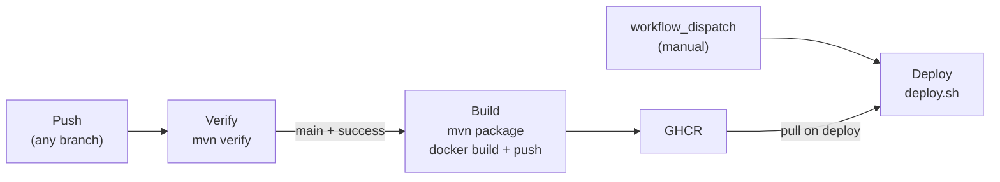
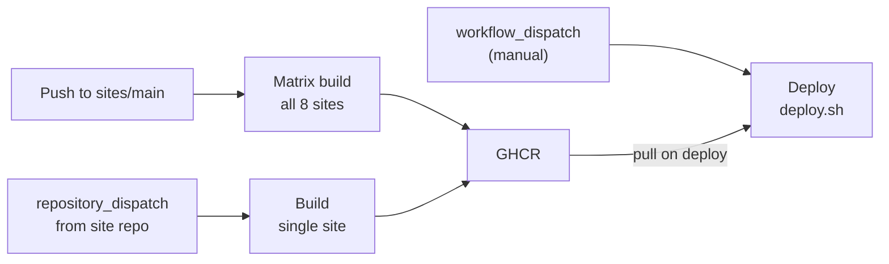
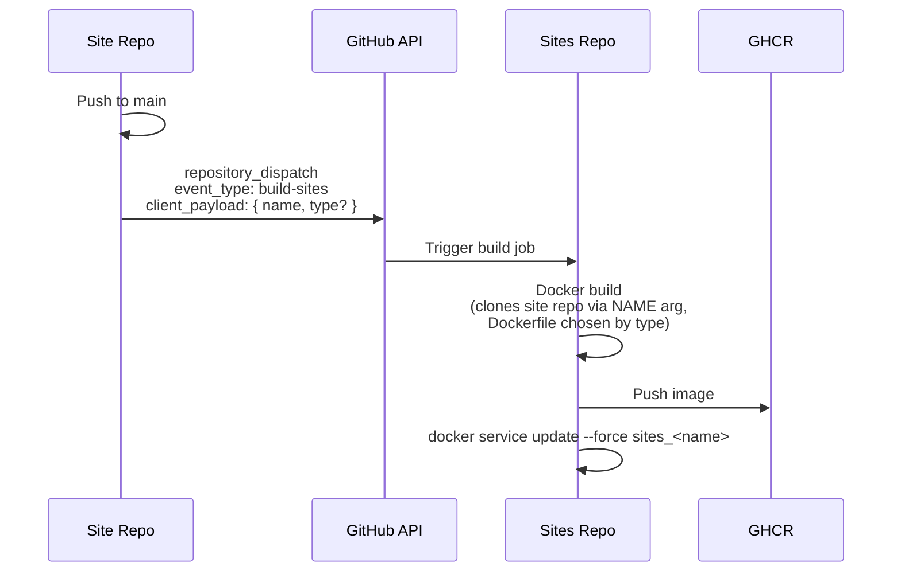

# GitHub Actions CI/CD

## Organization

- Org: [outsideworx](https://github.com/outsideworx)
- Registry: GitHub Container Registry (GHCR) at `ghcr.io/outsideworx/<name>`

## Self-Hosted Runner

All workflows run on a self-hosted runner (`runs-on: outsideworx`) — the same machine that hosts the production Swarm cluster. No GitHub-hosted runners are used.

### Prerequisites

The runner must have the following installed and available on `PATH`:

| Dependency | Used by | Purpose |
|------------|---------|---------|
| Java (JDK) | services verify, services build | Compiles source, runs unit + integration tests, packages the JAR |
| Maven | services verify, services build | Orchestrates the full build lifecycle (compile → test → package) |
| Docker Engine | all builds, all deploys | Builds container images, pushes to GHCR, deploys Swarm stacks |
| Docker Buildx | sites build, services build | Multi-stage image builds via `docker/build-push-action` |
| Git | all workflows | Repository checkout and submodule initialization |

### Implications

- No `setup-java` or `setup-node` actions — tooling is pre-installed on the host
- Deploy workflows run `deploy.sh` directly on the host — the runner is the production server
- Docker commands execute against the local daemon (same Swarm manager node)
- The runner must be authenticated to GHCR for image pulls during deploy (handled by `docker login` in build steps; deploy relies on credentials cached on the host)

## Secrets

| Secret | Purpose |
|--------|---------|
| `DISPATCH_TOKEN` | GitHub PAT with `repo` scope — used as GHCR password for image pushes and for sending `repository_dispatch` events to the `sites` repo |
| `ENV` | Full `.env` file content (written to `.env` before running `deploy.sh`) |

All secrets are org-level and inherited by all repos automatically.

## Services Pipeline

```mermaid
flowchart LR
    push["Push\n(any branch)"] --> verify["Verify\nmvn verify"]
    verify -->|"main + success"| build["Build\nmvn package\ndocker build + push"]
    build --> ghcr["GHCR"]
    dispatch["workflow_dispatch\n(manual)"] --> deploy["Deploy\ndeploy.sh"]
    ghcr -->|"pull on deploy"| deploy
```

- **Verify** (`verify.yaml`): Runs `mvn verify` on every push. All branches.
- **Build** (`build.yaml`): Triggered by `workflow_run` on `main`; only runs if Verify concluded with `success` (`if: conclusion == 'success'`). Packages JAR, builds Docker image, pushes to GHCR.
- **Deploy** (`deploy.yaml`): Manual `workflow_dispatch`. Checks out repo, writes `.env` from secret, runs `deploy.sh` directly on the host.

## Sites Pipeline

```mermaid
flowchart LR
    main_push["Push to sites/main"] --> matrix["Matrix build\nall 8 sites"]
    repo_dispatch["repository_dispatch\nfrom site repo"] --> single["Build\nsingle site"]
    matrix --> ghcr["GHCR"]
    single --> ghcr
    manual["workflow_dispatch\n(manual)"] --> deploy["Deploy\ndeploy.sh"]
    ghcr -->|"pull on deploy"| deploy
```

- **Build — push** (`build.yaml`, `build-sites` job): On push to `main`, builds all sites in parallel via a matrix (`strategy.matrix.include`). Each entry sets the `NAME` build arg; the `tunde-divat` entry also sets `type: npm`. The Dockerfile is selected dynamically: `file: Dockerfile${{ matrix.type && format('.{0}', matrix.type) || '' }}` — no type → `Dockerfile`, `npm` → `Dockerfile.npm`.
- **Build — dispatch** (`build.yaml`, `build` job): On a `repository_dispatch` with `event_type: build-sites`, builds only the site named in `client_payload.name`, selecting the Dockerfile from `client_payload.type` the same way. Its final step then **auto-deploys** the new image by force-updating the running Swarm service (`docker service update --force --with-registry-auth --image ghcr.io/outsideworx/<name>:latest sites_<name>`). This is the live deployment path for site content — a push to a site repo goes to production with no manual step. (The matrix `build-sites` job does **not** do this — it only pushes images to GHCR.)
- **Deploy** (`deploy.yaml`): Same pattern as services — checks out repo, writes `.env`, runs `deploy.sh` on the host.

## Site Repo Dispatch

```mermaid
sequenceDiagram
    participant SiteRepo as Site Repo
    participant API as GitHub API
    participant SitesRepo as Sites Repo
    participant GHCR as GHCR

    SiteRepo->>SiteRepo: Push to main
    SiteRepo->>API: repository_dispatch<br/>event_type: build-sites<br/>client_payload: { name, type? }
    API->>SitesRepo: Trigger build job
    SitesRepo->>SitesRepo: Docker build<br/>(clones site repo via NAME arg,<br/>Dockerfile chosen by type)
    SitesRepo->>GHCR: Push image
    SitesRepo->>SitesRepo: docker service update --force sites_<name>
```

Each site repo has a single workflow (`build.yaml`) with no checkout and no build step. On push to `main`, it calls the GitHub API to send a `repository_dispatch` event to the `sites` repo with `event_type: build-sites` and `client_payload: { name: '<name>' }` — plus `type: 'npm'` for the `tunde-divat` app. There is one shared event type (`build-sites`), not a per-site event. The `sites` repo receives this, selects the Dockerfile from `client_payload.type`, and builds the image — cloning the site repo's content at Docker build time via the `NAME` build arg — then force-updates the running Swarm service. The site repo never touches Docker directly.

## Current Sites

Keep this table in sync with `strategy.matrix.include` in `sites/.github/workflows/build.yaml` and with the sites table in `sites-deployment.md`. All site repos dispatch the same `event_type: build-sites`; the `client_payload` distinguishes them.

| Site | `client_payload.name` | `client_payload.type` | Dockerfile |
|------|-----------------------|-----------------------|------------|
| come-in-and-find-out | `come-in-and-find-out` | — | `Dockerfile` |
| duckumbrella | `duckumbrella` | — | `Dockerfile` |
| gaiapeeps | `gaiapeeps` | — | `Dockerfile` |
| igli | `igli` | — | `Dockerfile` |
| outsideworx | `outsideworx` | — | `Dockerfile` |
| soupart | `soupart` | — | `Dockerfile` |
| soupkitchen | `soupkitchen` | — | `Dockerfile` |
| tunde-divat | `tunde-divat` | `npm` | `Dockerfile.npm` |
